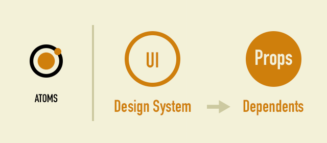
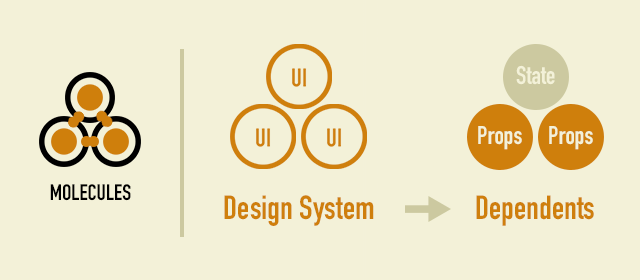
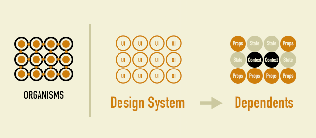
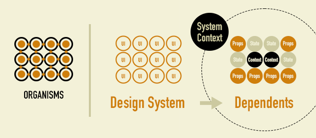
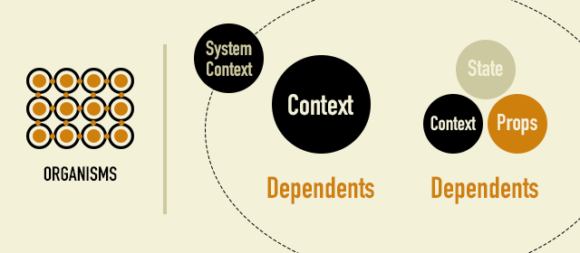
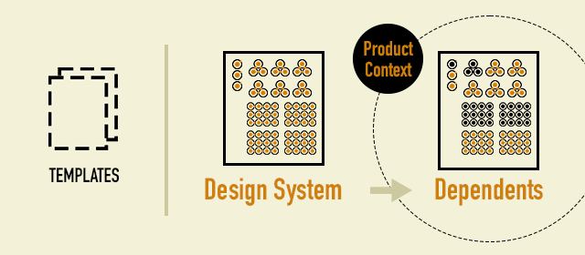
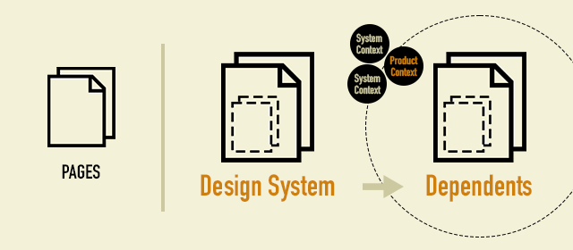

# Redefinition of Atoms - Atomic ReDesign -

"Atomic ReDesign" is an extension of the famous "Atomic Design". When designing components with React and Vue.js, we often had a headache. UI granularity classification constraints can prevent component design optimization.

There was no unified solution to the question, "Where do components of this granularity belong?", And it had to be determined by the nature of each product. Also, the scattered context caused a loss of concentration on the code.

Atomic ReDesign aims to capture the actual "difference between Atomic Design and application design" and become a realistic design guideline.

## The gap between Atomic Design and application design

The original Atomic Design is a design concept for building a design system. It is suitable for building a disciplined design system with the aim of increasing reusability with a modular UI. Before adopting this design concept as it is, there are some things to check.

"Is the design target a design system?"
If your design is an application, the answer to this question is "No". I think this is the difference between whether Atomic Design is operating well or not.

Atomic ReDesign that "redefines the atom" while keeping the convention of "atom = minimum module unit". This is based on the perspective that "the smallest unit of an indivisible module is not the UI" when building an application. The components of a component go beyond UI design. The smallest module unit advocated by Atomic ReDesign is "dependency".

## Redefinition of atoms

By redefining the atom, which is the smallest unit, as "dependence", we will see what kind of change there is.

### Atoms

Atoms are the smallest unit for building a module. In the case of a design system, the smallest indivisible unit is the button UI, etc., but in Atomic ReDesign, the smallest unit is **unidirectional reference dependency such as Props**. This means that **does not classify by "component particle size" such as "button, card, layout"**.

### Molecules

The original Molecules represents a meaningful granular UI. For example, by aligning the "title, button, and input area", it will be established as a UI that provides one function. In the case of the component used for the application, not only Props but also **Local State** is kept inside the component, and **state and value may be interdependent**. Atomic ReDesign considers the interdependencies closed within this component to be one Molecules.

### Organisms

Organisms is a complex built with Atoms and Molecules. For Atomic ReDesign, **Global State** is included as a dependency factor. Context, React's standard API, is taken as an example here, but it can be a Global State provided by a third-party library.

Here, let's look back on the major classification "System / Product" defined by the original Atomic Design. This major classification is an important boundary between "general purpose and non-general purpose".

This boundary is also followed by Atomic ReDesign. It means that the components belonging to Organisms depend on **a cross-reusable Global State "System Context"**.

This means that any granular component that depends on a "System Context" will be classified as Organisms. "Button / card / layout" etc. **We do not classify by "component particle size".** This constraint release promotes optimization of redrawing design in component design.

To summarize the story so far, the illustrated ◉ looks like a correlation diagram of stakeholders who share states and values. It's also a community that shares a particular Sytem Context.

### Templates

In Atomic ReDesign, template indicates that it contains a **"Product Context"** dependency. In contrast to Organisms, which depend on a "System Context", the "specific use case" paired with a page is the Product Context. It can also be said that the Product Context holds page-specific information.

In addition to those that depend on the "Product Context", small components that are not intended to be reused as the "System" are also stored in the module as parts that build the template. The process of subdividing a component into smaller pieces is more precious than anything else, and non-dispersive conventions keep your coding focused.

### Pages

FWs such as Next.js define a page along with routing. It is your responsibility to fetch the values ​​sent and received from the fetch API and serverside into the template. It is also the connection point with each Context Provider of "System / Product".

Atomic ReDesign replaces the atomic unit from "UI" to "dependence", but the flow / division thesaurus that builds the final product follows the original Atomic Design as it is. The process of dividing into atoms is equivalent to the process of refactoring, which gradually removes dependence.

By performing "redefinition of atoms" as explained, it is possible to make the design rules suitable for the development target. In this article, we focused on the differences between atoms in "design system design / application design", but redefining atoms other than "state-dependent" does not mean that they can be applied to modular design in general. Is not it.
